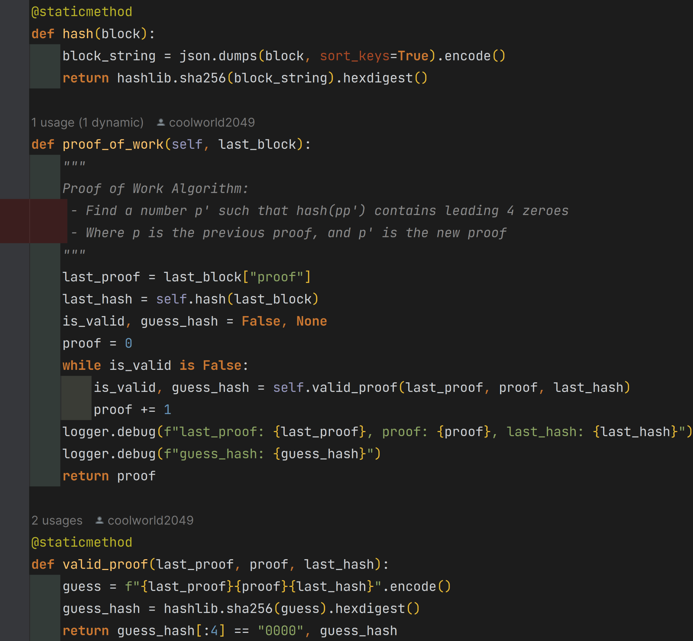
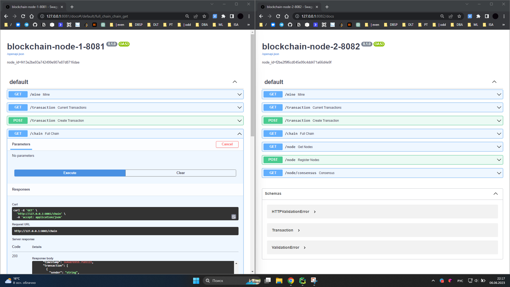

# Введение

**Блокчейн** --- это децентрализованная одноранговая сеть. Его основная
цель --- выполнять транзакции в ненадежной среде и хранить данные
транзакций в неизменяемой базе данных.

**Сеть блокчейна** состоит из узлов, распределенного реестра, актива и
алгоритма консенсуса. Иногда он также включает виртуальную машину и базу
данных состояний.

{width="5.885483377077866in"
height="4.9552274715660545in"}

**Узлы**

> формируют структуру сети блокчейн. Узлы в сети выполняют разные
> обязанности, например, майнер и валидатор . Узлы --- это устройства с
> вычислительной мощностью и установленным приложением узла. Различные
> блокчейны имеют разные приложения узлов, содержащие данные и правила,
> которые действуют как узлы в соответствующем блокчейне.

**Распределенный реестр**

> также известен как база данных блокчейна. Каждый узел в сети имеет
> копию реестра для обеспечения отказоустойчивости сети. Реестр
> неизменен и виден всем в сети блокчейн. Он состоит из последовательно
> связанных блоков, содержащих активы. Блоки связаны друг с другом с
> помощью хэша предыдущего блока.

**Объект**

> Активом может быть практически что угодно, как физическое, так и
> нефизическое, имеющее ценность, признанную узлами в сети. Вот
> некоторые примеры активов:

-   Финансовые транзакции: Блокчейны, такие как Биткойн и Догекойн,
    > используют бухгалтерскую книгу для хранения данных транзакций
    > своих криптовалют.

-   Блоки кода: такие блокчейны, как Ethereum, используют его для
    > хранения кода в виде смарт-контрактов, что служит основой
    > концепции Dapps.

-   Медицинские записи: Частные блокчейны обычно хранят медицинские
    > записи пациентов, чтобы сохранить целостность в ненадежной среде.

-   Бизнес-транзакции: компании могут использовать частные блокчейны при
    > выполнении транзакций с участием других компаний, чтобы обеспечить
    > целостность продукта и соблюдение определенных условий, что
    > приведет к большей безопасности и подотчетности.

**Алгоритм консенсуса**

> это то, что делает блокчейн успешной альтернативой для
> централизованных приложений. В случае централизованных приложений все
> пользователи доверяют центральному органу для надежного выполнения
> транзакций. Однако при отсутствии центрального органа эта
> ответственность ложится на узлы в сети. Блокчейны используют алгоритмы
> консенсуса, такие как Proof of Work (POW) и [[Proof of
> Stake]{.underline}](https://www.educative.io/answers/what-is-proof-of-stake)
> (POS), для достижения консенсуса в ненадежной среде. Алгоритм
> консенсуса отправляет транзакцию, выполненную майнером, на узлы
> валидации для достижения консенсуса. Если консенсус достигнут,
> транзакция добавляется в реестр, в противном случае она отбрасывается.

**Виртуальная машина**

> Блокчейны, такие как Ethereum, запускают виртуальные машины на своих
> узлах. Они используются для выполнения кода, написанного в
> смарт-контрактах . Это сделано для того, чтобы гарантировать, что если
> код, исполняемый на узлах, содержит вредоносное ПО, это не повлияет на
> узел, выполняющий код. Вместо этого это повлияет только на виртуальную
> машину, работающую поверх реального оборудования, сохраняя узел.

**База данных состояния**

> Это база данных «ключ-значение» , которая представляет текущее
> состояние сети. Он рассчитывается путем обхода реестра. Он
> используется для экономии времени во время транзакций, так как во
> время каждой транзакции требуется обновленное состояние сети, а обход
> всего реестра в каждой транзакции замедляет работу сети.

# Отчет

## Хранение транзакций в блоках

Транзакции упакованы в блоки. Блок может содержать одну или несколько
транзакций. Блоки, содержащие транзакции, часто генерируются и
добавляются в блокчейн. Поскольку блоков может быть несколько, каждый
блок должен иметь уникальный идентификатор:

{width="7.479330708661418in"
height="3.236111111111111in"}

##  

## Хэширование

Мы хотели бы предотвратить любое вмешательство в данные, хранящиеся
внутри блока, и обнаружение --- первый шаг к этому. Чтобы определить,
подделаны ли данные в блоке, мы можем использовать криптографические
хэш-функции.

Криптографическая хеш-функция - это математический алгоритм, который
отображает данные произвольного размера в битовый массив фиксированного
размера.

Результат, производимый хеш-функцией, называется «хеш-суммой» или же
просто «хешем», а входные данные часто называют «сообщением».

Для идеальной хеш-функции выполняются следующие условия:

-   хеш-функция является детерминированной, то есть одно и то же
    > сообщение приводит к одному и тому же хеш-значению

-   значение хеш-функции быстро вычисляется для любого сообщения

-   невозможно найти сообщение, которое дает заданное хеш-значение

-   невозможно найти два разных сообщения с одинаковым хеш-значением

-   небольшое изменение в сообщении изменяет хеш настолько сильно, что
    > новое и старое значения кажутся некоррелирующими

{width="7.479330708661418in"
height="1.3055555555555556in"}

## Соединение блоков

Нам нужен механизм, гарантирующий, что любое изменение в предыдущих
блоках делает недействительной всю цепочку. Биткоин делает это, создавая
зависимость между последовательными блоками, связывая их в цепочку с
хешем блока, непосредственно предшествующего им. Под цепочкой мы
подразумеваем включение хэша предыдущего блока в текущий блок в новое
поле с именем **previous_hash**.

{width="7.479330708661418in"
height="6.527777777777778in"}

Теперь, если содержимое любого из предыдущих блоков изменится,то

-   Хэш предыдущего блока изменится.

```{=html}
<!-- -->
```
-   Это приведет к несовпадению с previous_hash полем в следующем блоке.

-   Поскольку входные данные для вычисления хэша любого блока также
    > состоят из поля previous_hash, хеш следующего блока тоже
    > изменится.

В конечном итоге вся цепочка, следующая за замененным блоком, становится
недействительной, и единственный способ это исправить --- пересчитать
всю цепочку.

## Proof-of-Work

Если мы изменим предыдущий блок, мы можем легко пересчитать хэши всех
следующих блоков и создать другой действительный блокчейн. Чтобы
предотвратить это, мы теперь будем использовать асимметрию в подсчете
хеша:

> Хэш должен начинаться с «n ведущих нулей»
>
> {width="4.555159667541557in"
> height="0.30452318460192473in"},
>
> где n может быть любым положительным целым числом. Количество нулей,
> указанное в ограничении, определяет «сложность» нашего алгоритма Proof
> of Work (чем больше нулей, тем сложнее вычислить одноразовый номер).

{width="7.479330708661418in"
height="6.930555555555555in"}

{width="7.479330708661418in"
height="2.2222222222222223in"}

## Добавление блока в цепь

Чтобы добавить блок в цепочку, нам сначала нужно убедиться, что

-   Данные не изменены, т. е. предоставленное доказательство работы
    > верно.

-   Порядок транзакций сохраняется, т.е. previous_hash поле добавляемого
    > блока указывает на хэш последнего блока в нашей цепочке.

{width="7.479330708661418in"
height="4.069444444444445in"}

{

\"index\": 4,

\"transaction\": \[

{

\"sender\": \"qwe\",

\"recipient\": \"zxc\",

\"amount\": \"123\"

},

{

\"sender\": \"0\",

\"recipient\": \"0102d21f9ca343aea04de1e2ba63f746\",

\"amount\": 1

}

\],

\"proof\": 32192,

\"previous_hash\":
\"f1c68838a766bdf81ff3949a801d74a5ab78d962d66834bf5f817e56138e154f\"

}

## Майнинг

Транзакции будут изначально храниться как пул неподтвержденных
транзакций. Процесс помещения неподтвержденных транзакций в блок и
вычисления Proof of Work известен как майнинг блоков. Как только
вычислен одноразовый номер, удовлетворяющий нашим ограничениям, мы можем
сказать, что блок был добыт и его можно поместить в цепочку.

{width="4.903174759405075in"
height="2.0857600612423446in"}

\[

{

\"sender\": \"qwe\",

\"recipient\": \"zxc\",

\"amount\": \"123\"

},

{

\"sender\": \"qwe\",

\"recipient\": \"zxc\",

\"amount\": \"123\"

},

{

\"sender\": \"qwe\",

\"recipient\": \"zxc\",

\"amount\": \"123\"

},

{

\"sender\": \"qwe\",

\"recipient\": \"zxc\",

\"amount\": \"123\"

}

\]

{width="7.479330708661418in"
height="4.666666666666667in"}

## Консенсус и децентрализация

Чтобы перейти от одного узла к одноранговой сети, давайте сначала
создадим механизм, позволяющий новому узлу узнавать о других
одноранговых узлах в сети

{width="6.653174759405075in"
height="3.2889687226596673in"}

{width="6.674008092738408in"
height="5.434086832895888in"}

## Запуск с несколькими узлами

{width="4.246923665791776in"
height="5.2998807961504815in"}

{width="7.479330708661418in"
height="4.208333333333333in"}

### blockchain-node-1-8081

**/mine**

**...**

/**chain**

{

\"chain\": \[

{

\"index\": 1,

\"timestamp\": 1686079117.4799626,

\"transaction\": \[\],

\"proof\": 100,

\"previous_hash\": \"1\"

},

{

\"index\": 2,

\"timestamp\": 1686079131.2470558,

\"transaction\": \[

{

\"sender\": \"0\",

\"recipient\": \"4abc5047671c4b31bcd657cf04c8ca9d\",

\"amount\": 1

}

\],

\"proof\": 18214,

\"previous_hash\":
\"d725c7cb629337b47d03b2362be6aee0222fad69c5b964084d490854d6cf7b1b\"

},

{

\"index\": 3,

\"timestamp\": 1686079135.3883944,

\"transaction\": \[

{

\"sender\": \"0\",

\"recipient\": \"4abc5047671c4b31bcd657cf04c8ca9d\",

\"amount\": 1

}

\],

\"proof\": 42308,

\"previous_hash\":
\"0a8bb75c9f8cf594cbd40f795186685ea34777e7263d8def8851b7d052d177b2\"

}

\],

\"length\": 3

}

### blockchain-node-2-8082

/**chain**

{

\"chain\": \[

{

\"index\": 1,

\"timestamp\": 1686078900.04348,

\"transaction\": \[\],

\"proof\": 100,

\"previous_hash\": \"1\"

}

\],

\"length\": 1

}

/**node/consensus**

{

\"message\": \"Our chain was replaced\",

\"new_chain\": \[

{

\"index\": 1,

\"timestamp\": 1686079117.4799626,

\"transaction\": \[\],

\"proof\": 100,

\"previous_hash\": \"1\"

},

{

\"index\": 2,

\"timestamp\": 1686079131.2470558,

\"transaction\": \[

{

\"sender\": \"0\",

\"recipient\": \"4abc5047671c4b31bcd657cf04c8ca9d\",

\"amount\": 1

}

\],

\"proof\": 18214,

\"previous_hash\":
\"d725c7cb629337b47d03b2362be6aee0222fad69c5b964084d490854d6cf7b1b\"

},

{

\"index\": 3,

\"timestamp\": 1686079135.3883944,

\"transaction\": \[

{

\"sender\": \"0\",

\"recipient\": \"4abc5047671c4b31bcd657cf04c8ca9d\",

\"amount\": 1

}

\],

\"proof\": 42308,

\"previous_hash\":
\"0a8bb75c9f8cf594cbd40f795186685ea34777e7263d8def8851b7d052d177b2\"

}

\]

}
